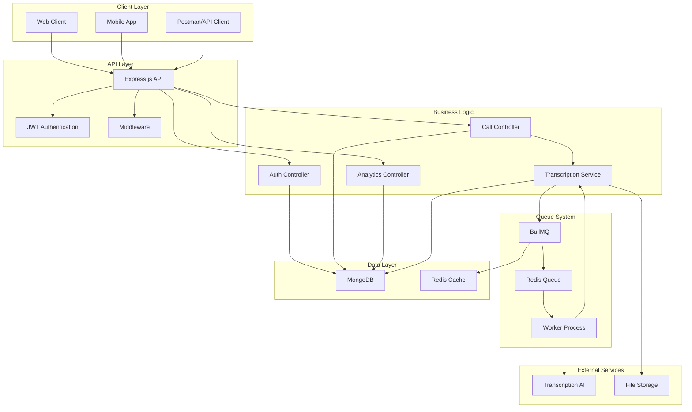
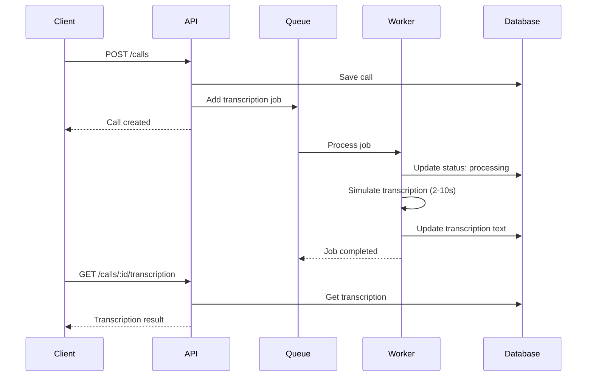
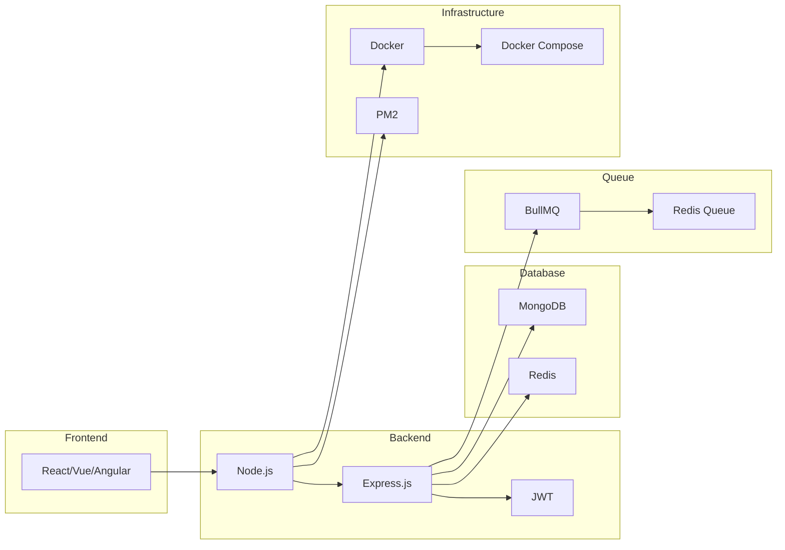

# AI Call Assistant API

AI-powered call management system. Includes user registration/login, call CRUD operations, and asynchronous transcription service.

## Features

- **User Management**: JWT-based authentication
- **Call Management**: CRUD operations
- **Asynchronous Transcription**: BullMQ queue system
- **Error Management**: Automatic retry mechanism
- **Search & Filtering**: Advanced search for calls
- **Duration Calculation**: Automatic call duration calculation
- **Docker Support**: Container-based deployment

## Requirements

- Node.js 20+
- MongoDB
- Redis
- Docker (optional)

## Installation

### Local Installation

1. **Clone the repository**
```bash
git clone <repository-url>
cd ai-call-assistant
```

2. **Install dependencies**
```bash
npm install
```

3. **Create environment file**
```bash
cp .env.example .env
```

4. **Configure environment variables**
```bash
nano .env
```

5. **Start MongoDB and Redis**
```bash
# MongoDB
mongod

# Redis
redis-server
```

6. **Run the project**
```bash
npm run dev
```

### Docker Installation

1. **Start Docker**
```bash
docker compose up -d --build
```

2. **Follow logs**
```bash
docker compose logs -f api
```

## Environment Variables

| Variable | Description | Default |
|----------|-------------|---------|
| `NODE_ENV` | Environment | `development` |
| `PORT` | Port | `3000` |
| `MONGODB_URI` | MongoDB connection string | `mongodb://localhost:27017/ai-call-assistant` |
| `REDIS_URL` | Redis connection string | `redis://localhost:6379` |
| `JWT_SECRET` | JWT secret key | `your-secret-key` |
| `JWT_EXPIRE` | JWT expiration | `7d` |

## API Endpoints

### Authentication

#### POST /api/auth/register
User registration

**Request:**
```json
{
  "username": "John Doe",
  "email": "john@example.com",
  "password": "123456"
}
```

**Response:**
```json
{
  "success": true,
  "data": {
    "_id": "...",
    "username": "John Doe",
    "email": "john@example.com",
    "role": "user",
    "token": "eyJhbGciOiJIUzI1NiIsInR5cCI6IkpXVCJ9..."
  }
}
```

#### POST /api/auth/login
User login

**Request:**
```json
{
  "email": "john@example.com",
  "password": "123456"
}
```

#### GET /api/auth/me
Get user information (Token required)

### Calls

#### POST /api/calls
Create call

**Request:**
```json
{
  "title": "Team Meeting",
  "participants": [
    {
      "name": "John Doe",
      "email": "john@example.com",
      "role": "host"
    }
  ],
  "notes": "Weekly sync",
  "startedAt": "2024-01-01T10:00:00Z",
  "endedAt": "2024-01-01T10:30:00Z"
}
```

#### GET /api/calls
Get all calls

**Query Parameters:**
- `page`: Page number (default: 1)
- `limit`: Records per page (default: 10)
- `status`: Status filter (scheduled, in-progress, completed, cancelled)
- `search`: Search term (searches in title and notes fields)
- `sort`: Sorting (default: -createdAt)

**Example:**
```
GET /api/calls?page=1&limit=5&status=completed&search=meeting&sort=title
```

#### GET /api/calls/:id
Get single call

#### GET /api/calls/:id/transcription
Get call transcription status

**Response:**
```json
{
  "success": true,
  "data": {
    "callId": "...",
    "title": "Team Meeting",
    "transcriptionStatus": "completed",
    "transcriptionText": "Meeting transcript...",
    "transcriptionRetryCount": 0,
    "transcriptionError": ""
  }
}
```

#### POST /api/calls/:id/retry-transcription
Retry transcription

#### PUT /api/calls/:id
Update call

#### DELETE /api/calls/:id
Delete call

## Transcription Process

1. **Call is created** → `transcriptionStatus: "pending"`
2. **Added to queue** → BullMQ job created
3. **Processing starts** → `transcriptionStatus: "processing"`
4. **After 2-10 seconds** → `transcriptionStatus: "completed"` or `"failed"`
5. **On error** → Automatic retry (3 attempts)

## Duration Calculation

If `startedAt` and `endedAt` fields are provided in the Call model, `duration` is automatically calculated:

```javascript
// Example: 30-minute call
{
  "startedAt": "2024-01-01T10:00:00Z",
  "endedAt": "2024-01-01T10:30:00Z",
  "duration": 1800 // 30 minutes (in seconds)
}
```

## Testing

### Postman Testing

1. **Create environment**
2. **Register/Login** → Get token
3. **Create call** → With token
4. **Check transcription status** → With token

### cURL Testing

```bash
# Register
curl -X POST http://localhost:3000/api/auth/register \
  -H "Content-Type: application/json" \
  -d '{"username":"Test User","email":"test@example.com","password":"123456"}'

# Create Call
curl -X POST http://localhost:3000/api/calls \
  -H "Content-Type: application/json" \
  -H "Authorization: Bearer YOUR_TOKEN" \
  -d '{"title":"Test Meeting","participants":[{"name":"John","email":"john@example.com","role":"host"}]}'

# Search Calls
curl -X GET "http://localhost:3000/api/calls?search=meeting" \
  -H "Authorization: Bearer YOUR_TOKEN"

# Retry Transcription
curl -X POST http://localhost:3000/api/calls/CALL_ID/retry-transcription \
  -H "Authorization: Bearer YOUR_TOKEN"
```

## Docker

### Development
```bash
docker compose up -d --build
```

### Production
```bash
docker compose -f docker-compose.yml up -d --build
```

## Monitoring

### Health Check
```bash
curl http://localhost:3000/health
```

### Logs
```bash
# Docker logs
docker compose logs -f api

# MongoDB logs
docker compose logs mongo

# Redis logs
docker compose logs redis
```

## Production Deployment

1. **Set environment variables**
2. **Use MongoDB Atlas**
3. **Use Redis Cloud**
4. **Process management with PM2**
5. **Nginx reverse proxy**
6. **Add SSL certificate**

## TODO

- [ ] Add rate limiting
- [ ] Write unit tests
- [ ] Integration tests
- [ ] API documentation (Swagger)
- [ ] Logging system (Winston)
- [ ] Monitoring (Prometheus)
- [ ] Caching strategy
- [ ] Database migration system
- [ ] Backup strategy
- [ ] CI/CD pipeline
- [ ] Load balancing
- [ ] Microservices architecture

## Contributing

1. Fork the repository
2. Create feature branch (`git checkout -b feature/amazing-feature`)
3. Commit changes (`git commit -m 'Add amazing feature'`)
4. Push to branch (`git push origin feature/amazing-feature`)
5. Create Pull Request

## Architecture Diagram

### System Architecture



### Data Flow



### Technology Stack




## 🧪 Testing

### Unit Tests

Run the test suite:

```bash
# Run all tests
npm test

# Run tests in watch mode
npm run test:watch

# Run tests with coverage
npm run test:coverage

# Run tests for CI
npm run test:ci
```

### Test Coverage

The project includes comprehensive unit tests with coverage reporting:

- **Auth Controller**: Registration, login, user info
- **Call Controller**: CRUD operations, validation
- **Middleware**: Authentication, error handling
- **Models**: Data validation, relationships

### Postman Collection

Import the Postman collection to test the API:

1. **Download files:**
   - [postman-collection.json](./postman-collection.json)
   - [postman-environment.json](./postman-environment.json)

2. **Import to Postman:**
   - Open Postman
   - Click "Import"
   - Select both JSON files
   - Set up environment variables

3. **Usage:**
   - Start with "Register User" or "Login User"
   - Token will be automatically saved
   - Test all endpoints in sequence

### Test Data

The collection includes:
- Authentication flow
- Call CRUD operations
- Transcription testing
- Analytics endpoints
- Error scenarios
- Filtering and pagination

